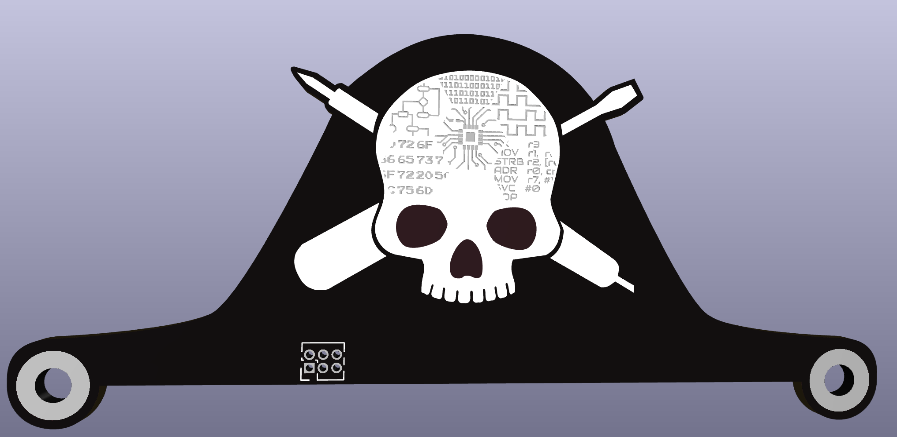
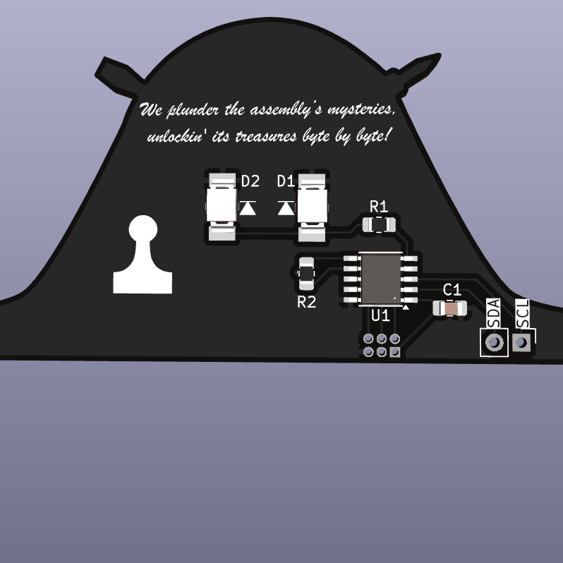
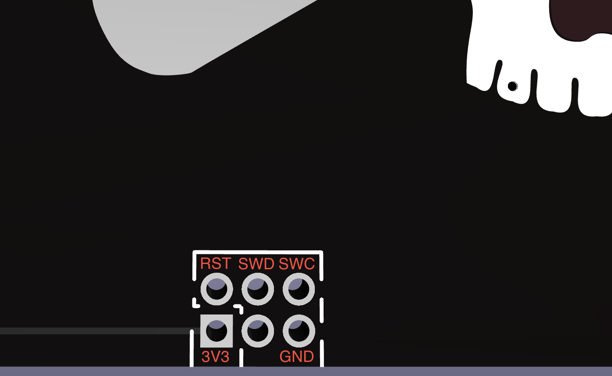

# SaintCon 2024 Badge RE Topper
A reverse engineering themed SaintCon 2024 badge topper

## Bill of Materials 
* 1x PY32F002AA15M
* 2x OSRAM TOPLED LS T77K LEDs
* 1x 100 Ohm 0805 Resistor
* 1x 1M Ohm 0805 Resistor
* 1uF 0805 Capacitor

## Assembly instructions
1. Solder on the py32 microcontroller paying attention to pin 1 orientation
2. Solder on the 2 LEDs paying attention to direction. 
	- The black mark should be towards the bottom of the badge.
3. Solder on the 2 resistors, orientation doesn't matter
	- R1 is the 100 ohm resistor (101 marking) 
	- R2 is the 1M ohm resistor (105 marking)
4. Solder on the capacitor, orientation doesn't matter

## Flashing instructions
> [!NOTE]
>If you obtained the components during Saintcon the py32 is already flashed and you can skip the remainder of these steps.
Required hardware & software
- ST-Link V2 clone
- PyOCD [https://pyocd.io/](https://pyocd.io/) installed.

Connect 3.3V, GND, SWDIO, SWCLK, and RST to the ST-Link. These are all broken out on the 2x3 1.00mm pin header.

To flash the MCU just execute `make flash` from the Fimware directory.

